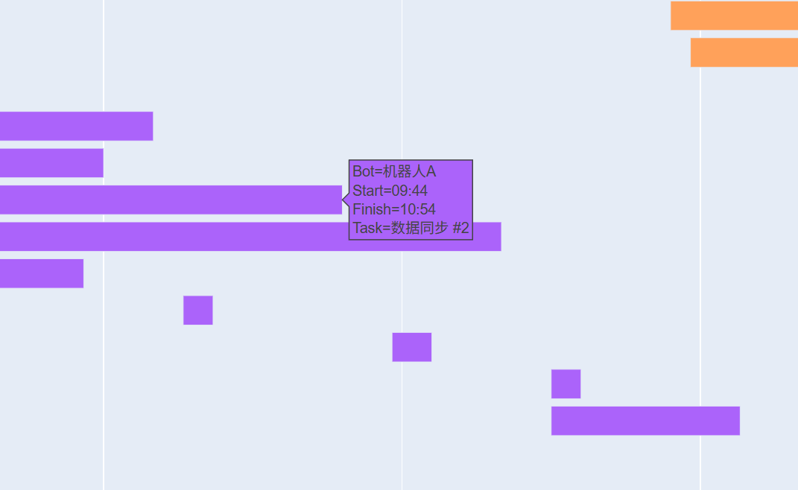

# 自动化任务甘特图生成器

这是一个使用 Python 和 Plotly 开发的工具，旨在将自动化程序的任务执行记录可视化为一份交互式的甘特图。

该工具可以直接从一个`CSV`文件中读取任务数据，动态生成一个HTML网页图表，帮助用户直观地分析任务的执行时间、并行情况和不同执行单元（机器人）的负载。

## ✨ 主要特性

- **数据驱动**: 图表内容完全由外部 `tasks.csv` 文件定义，无需修改代码即可更新任务。
- **高度交互性**: 生成的图表是HTML格式，支持在浏览器中进行缩放、平移和查看数据悬浮提示。
- **智能分类**: 自动根据“运行机器人”字段对任务进行颜色编码，并生成图例，一目了然。
- **X轴独立缩放**: 支持锁定Y轴，仅对时间轴（X轴）进行拉伸缩放，便于查看分钟级任务细节。
- **动态高度调整**: 图表高度会根据任务数量自动适配，当任务过多时，可通过浏览器滚动条查看所有任务。
- **时间范围滑块**: 在图表下方提供一个便捷的时间范围选择滑块，用于快速导航和筛选时间区间。

## ⚙️ 环境要求

确保您的环境中已经安装了 Python 3。然后，您需要安装以下两个库：

- **Pandas**: 用于高效地读取和处理CSV数据。
- **Plotly**: 用于生成强大的交互式图表。

## 📋 使用方法

1.  **准备数据文件**:
    创建一个名为 `tasks.csv` 的文件，并确保它与主Python脚本位于同一个目录下。该文件必须包含以下四列：`Task`, `Start`, `Finish`, `Bot`。

2.  **编辑数据**:
    用文本编辑器或Excel打开 `tasks.csv` 文件，按照以下格式添加您的任务数据：
    - `Task`: 任务的唯一名称（字符串）。
    - `Start`: 任务的开始时间，格式为 `HH:MM:SS`。
    - `Finish`: 任务的结束时间，格式为 `HH:MM:SS`。
    - `Bot`: 执行该任务的机器人或服务名称，用于颜色分类（字符串）。

    **文件示例:**
    ```csv
    Task,Start,Finish,Bot
    数据同步 #1,09:08:00,09:25:00,机器人A
    日志分析 #1,09:01:00,10:11:00,数据中心服务
    AI模型训练 #1,09:05:00,09:12:00,机器人C
    ...
    ```

3.  **运行脚本**:
    在终端中，导航到项目所在的目录，然后运行Python脚本（假设您的脚本名为 `create_gantt.py`）：
    ```bash
    python create_gantt.py
    ```

4.  **查看图表**:
    脚本运行后，会自动在您的默认浏览器中打开一个新标签页，显示生成的交互式甘特图。

## 🔧 自定义与调整

您可以通过修改Python脚本中的几个关键参数来自定义图表的观感：

- **任务行高**:
  在代码中找到 `row_height` 变量，修改其值（例如 `row_height = 35`）可以调整Y轴上每个任务条的高度，从而改变整体的疏密程度。

- **图表边距**:
  在 `fig.update_layout()` 函数中，可以调整 `margin` 字典的值，例如 `margin=dict(t=100, b=50, l=50, r=50)` 来控制图表的上(`t`)、下(`b`)、左(`l`)、右(`r`)边距。

- **时间轴格式**:
  在 `fig.update_xaxes()` 中，可以修改 `tickformat` 参数来改变时间的显示格式。例如，`tickformat='%H:%M'` 将只显示小时和分钟。

## 效果图展示

以下是使用此工具生成的一些甘特图效果示例。

### 1. 全局任务概览

展示了所有任务在时间轴上的分布情况，并通过颜色区分不同机器人执行的任务。由于任务数量较多，图表自动调整了高度，浏览器出现垂直滚动条。


### 2. 时间轴缩放细节

通过鼠标滚轮或范围滑块，可以轻松拉长时间轴（X轴），查看特定时间段内各任务的精确起止点和并行状态，而Y轴的任务列表保持固定，体验良好。


### 3. 数据悬浮提示

当鼠标悬停在任何一个任务条上时，会浮现一个信息框，清晰地展示该任务的名称、起止时间以及执行的机器人等详细信息。



---